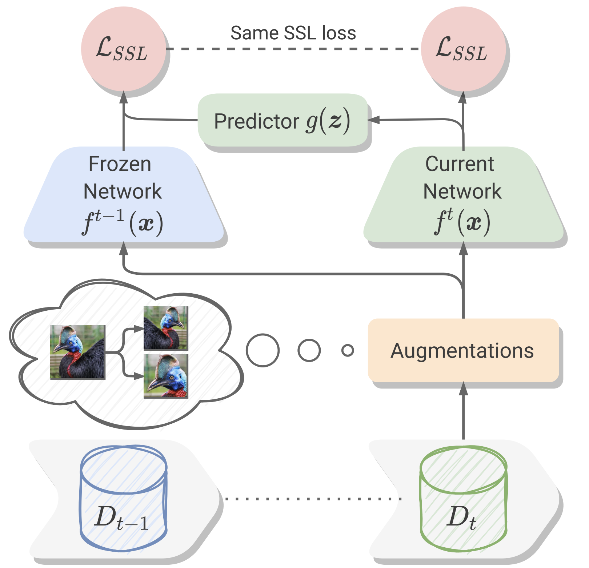
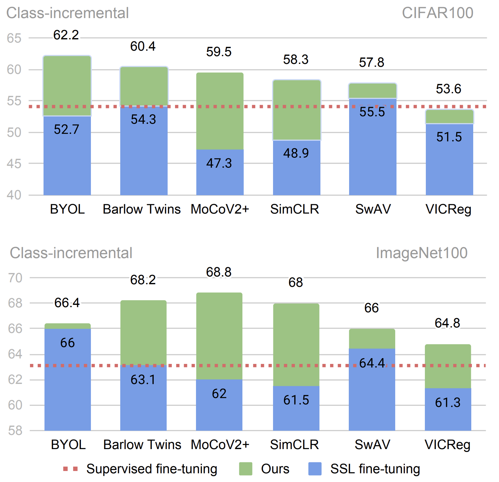

# Self-Supervised Models are Continual Learners
This is the official repository for the paper:
> **[Self-Supervised Models are Continual Learners](https://arxiv.org/abs/2112.04215)**<br>
> [Enrico Fini*](https://scholar.google.com/citations?user=OQMtSKIAAAAJ&hl=en), [Victor Turrisi*](https://scholar.google.com/citations?user=UQctXiEAAAAJ&hl=en&oi=ao), [Xavier Alameda-Pineda](https://scholar.google.com/citations?hl=en&user=ukI2bz8AAAAJ), [Elisa Ricci](https://scholar.google.com/citations?user=xf1T870AAAAJ&hl=en), [Karteek Alahari](https://scholar.google.com/citations?hl=en&user=qcyG7rwAAAAJ), [Julien Mairal](https://scholar.google.com/citations?hl=en&user=Bx9WGD6lBFEC)<br>
> **CVPR 2022**

> **Abstract:** *Self-supervised models have been shown to produce comparable or better visual representations than their supervised counterparts when trained offline on unlabeled data at scale. However, their efficacy is catastrophically reduced in a Continual Learning (CL) scenario where data is presented to the model sequentially. In this paper, we show that self-supervised loss functions can be seamlessly converted into distillation mechanisms for CL by adding a predictor network that maps the current state of the representations to their past state. This enables us to devise a framework for Continual self-supervised visual representation Learning that (i) significantly improves the quality of the learned representations, (ii) is compatible with several state-of-the-art self-supervised objectives, and (iii) needs little to no hyperparameter tuning. We demonstrate the effectiveness of our approach empirically by training six popular self-supervised models in various CL settings.*
<br>
<p align="center" float="left">
     
    
    <em>Overview of our method and results</em>
</p>

NOTE: most of the code in this repository is borrowed from [solo-learn](https://github.com/vturrisi/solo-learn)

# Installation
Use the following commands to create an environment and install the required packages (needs `conda`):
```
conda create --name cassle python=3.8
conda activate cassle
conda install pytorch=1.10.2 torchvision cudatoolkit=11.3 -c pytorch
pip install pytorch-lightning==1.5.4 lightning-bolts wandb sklearn einops
pip install --extra-index-url https://developer.download.nvidia.com/compute/redist --upgrade nvidia-dali-cuda110
```
Remember to check your cuda version and modify the install commands accorgingly.

OPTIONAL: consider installing `pillow-SIMD` for faster data loading:
```
pip uninstall pillow
CC="cc -mavx2" pip install -U --force-reinstall pillow-simd
```

# Commands
Here below you can find a few example commands for running our code. The bash scripts with full training configurations for our continual and linear evaluation experiments can be found in the `bash_files` folder. Use our `job_launcher.py` to launch continual self-supervised learning experiments. You can pass the desired configuration for your job (bash script, data directory, number of GPUs, etc...).

NOTE: each experiment uses a different number of gpus (1 for CIFAR100, 2 for ImageNet100 and 4 for DomainNet). You can change this setting directly in the bash scripts.

## Fine-tuning
### CIFAR100
E.g. running Barlow Twins:
```
DATA_DIR=/path/to/data/dir/ CUDA_VISIBLE_DEVICES=0 python job_launcher.py --script bash_files/continual/cifar/barlow_distill.sh
```
### ImageNet100
#### Class-incremental
E.g. running BYOL:
```
DATA_DIR=/path/to/data/dir/ CUDA_VISIBLE_DEVICES=0,1 python job_launcher.py --script bash_files/continual/imagenet-100/class/byol.sh
```
#### Data-incremental
E.g. running SimCLR:
```
DATA_DIR=/path/to/data/dir/ CUDA_VISIBLE_DEVICES=0,1 python job_launcher.py --script bash_files/continual/imagenet-100/data/simclr.sh
```
### DomainNet
E.g. running SwAV:
```
DATA_DIR=/path/to/data/dir/ CUDA_VISIBLE_DEVICES=0,1,2,3 python job_launcher.py --script bash_files/continual/domainnet/swav.sh
```

## CaSSLe
After running fine-tuning, you can also run CaSSLe by just loading the checkpoint of the first task. You will find all the checkpoints in your experiment directory (defaults to `"./experiments"`). Check the id of your run on WandB to make sure you are loading the correct checkpoint.
### CIFAR100
E.g. running Barlow Twins + CaSSLe:
```
PRETRAINED_PATH=/path/to/task0/checkpoint/ DATA_DIR=/path/to/data/dir/ CUDA_VISIBLE_DEVICES=0 python job_launcher.py --script bash_files/continual/cifar/barlow_distill.sh
```
### ImageNet100
#### Class-incremental
E.g. running BYOL + CaSSLe:
```
PRETRAINED_PATH=/path/to/task0/checkpoint/ DATA_DIR=/path/to/data/dir/ CUDA_VISIBLE_DEVICES=0,1 python job_launcher.py --script bash_files/continual/imagenet-100/class/byol_distill.sh
```
#### Data-incremental
E.g. running SimCLR + CaSSLe:
```
PRETRAINED_PATH=/path/to/task0/checkpoint/ DATA_DIR=/path/to/data/dir/ CUDA_VISIBLE_DEVICES=0,1 python job_launcher.py --script bash_files/continual/imagenet-100/data/simclr_distill.sh
```

### DomainNet
E.g. running SwAV + CaSSLe:
```
PRETRAINED_PATH=/path/to/task0/checkpoint/ DATA_DIR=/path/to/data/dir/ CUDA_VISIBLE_DEVICES=0,1,2,3 python job_launcher.py --script bash_files/continual/domainnet/swav_distill.sh
```

## Linear Evaluation
For linear evaluation you do not need the job launcher. You can simply run the scripts from `bash_files/linear`, e.g., for VICReg:
```
PRETRAINED_PATH=/path/to/last/checkpoint/ DATA_DIR=/path/to/data/dir/ bash bash_files/linear/imagenet-100/class/vicreg_linear.sh
```

# Logging
Logging is performed with [WandB](https://wandb.ai/site). Please create an account and specify your `--entity YOUR_ENTITY` and `--project YOUR_PROJECT` in the bash scripts. For debugging, or if you do not want all the perks of WandB, you can disable logging by passing `--offline` in your bash scripts. After training you can always sync an offline run with the following command: `wandb sync your/wandb/run/folder`.

# Citation
If you like our work, please cite our [paper](https://arxiv.org/abs/2112.04215):
```
@inproceedings{fini2021self,
  title={Self-Supervised Models are Continual Learners},
  author={Fini, Enrico and da Costa, Victor G Turrisi and Alameda-Pineda, Xavier and Ricci, Elisa and Alahari, Karteek and Mairal, Julien},
  booktitle={Proceedings of the IEEE/CVF Conference on Computer Vision and Pattern Recognition},
  year={2022}
}
```
